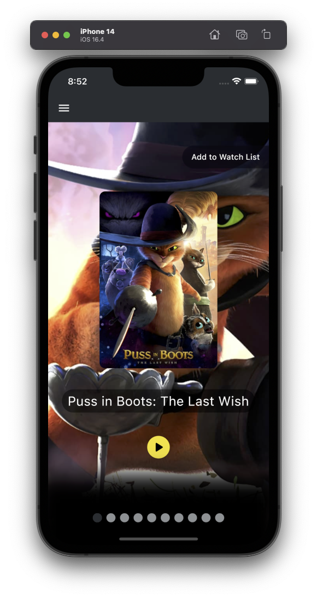
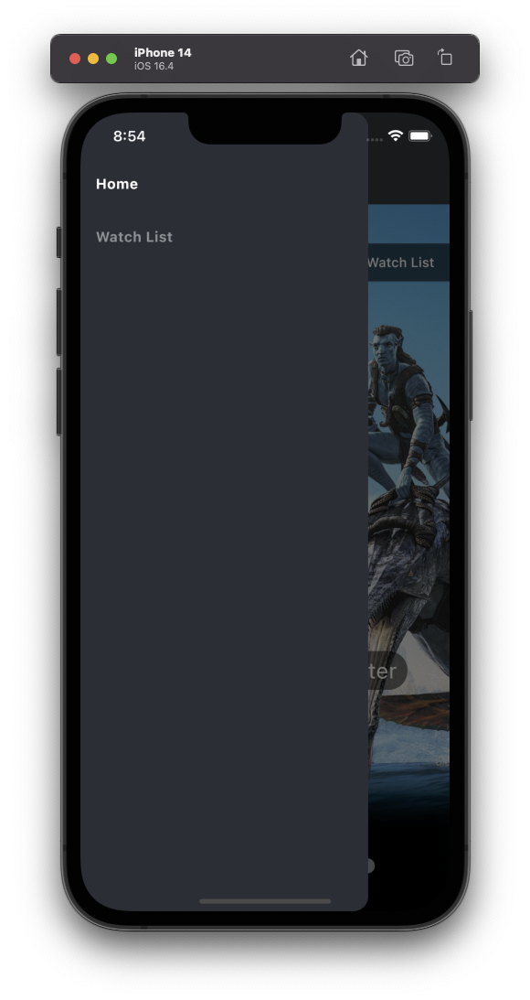

# Movies
 
Movies Application is a cross-platform mobile application designed for movie enthusiasts. It offers an interactive way to explore a vast collection of movies, posters, and trailers.

The application is developed using Flutter, making it compatible with both iOS and Android devices. The backend services are efficiently handled by Spring Boot and the data is stored in MongoDB.

  
  

## Features
- Explore a vast collection of movies.
- Add each movie to watch list.
- Watch movie trailers directly from the app.

## Technologies
- Frontend: Flutter
- Backend: Spring Boot
- Database: MongoDB

## Acknowledgements
I would like to express our deepest appreciation to the [source project](https://github.com/fhsinchy/movieist) from which I borrowed the pre-movie data.

## Contact
If you have any questions, issues, or suggestions, please feel free to open an issue or contact us directly.
